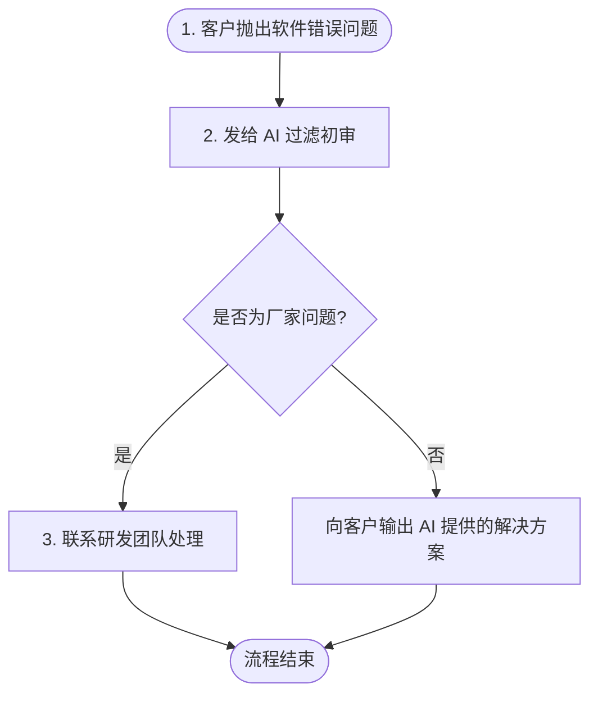
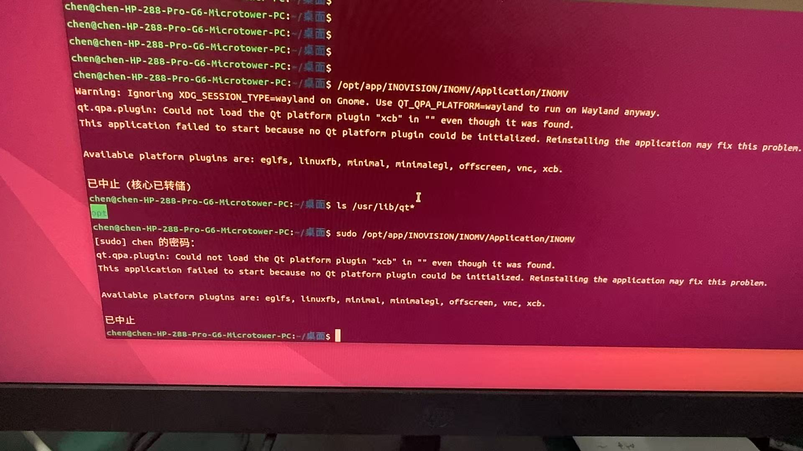
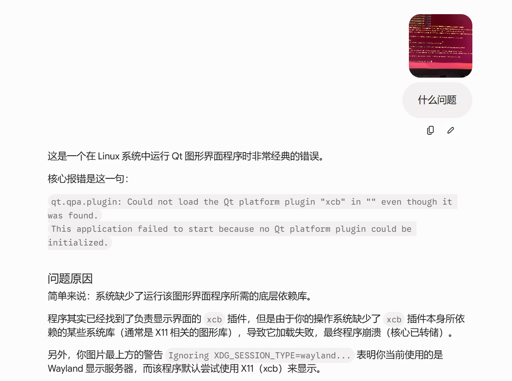
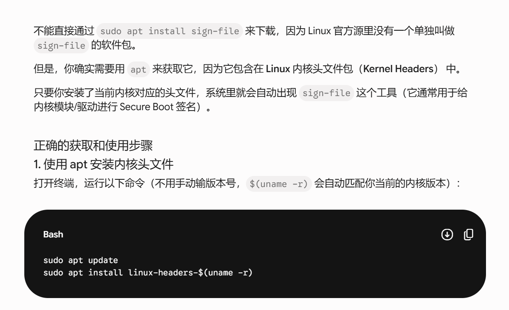
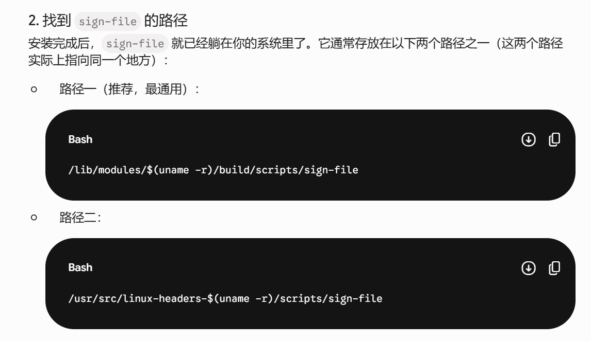
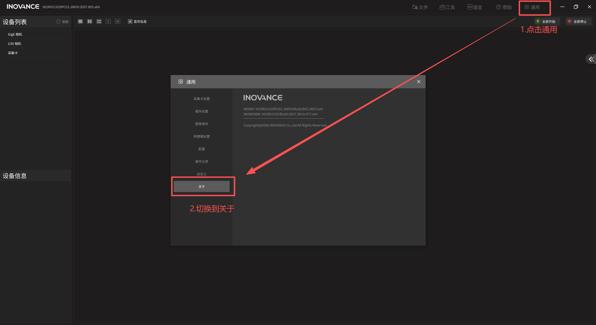
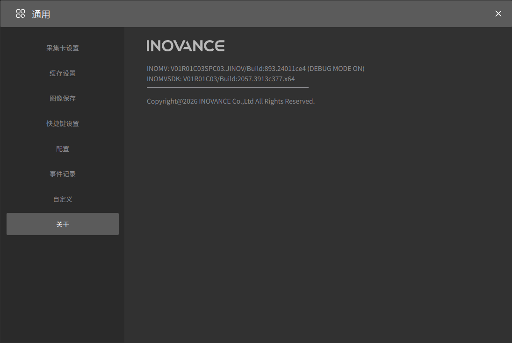
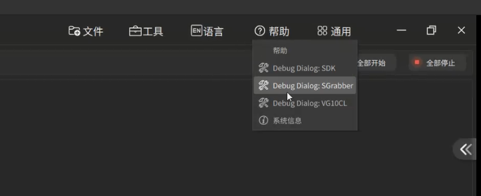
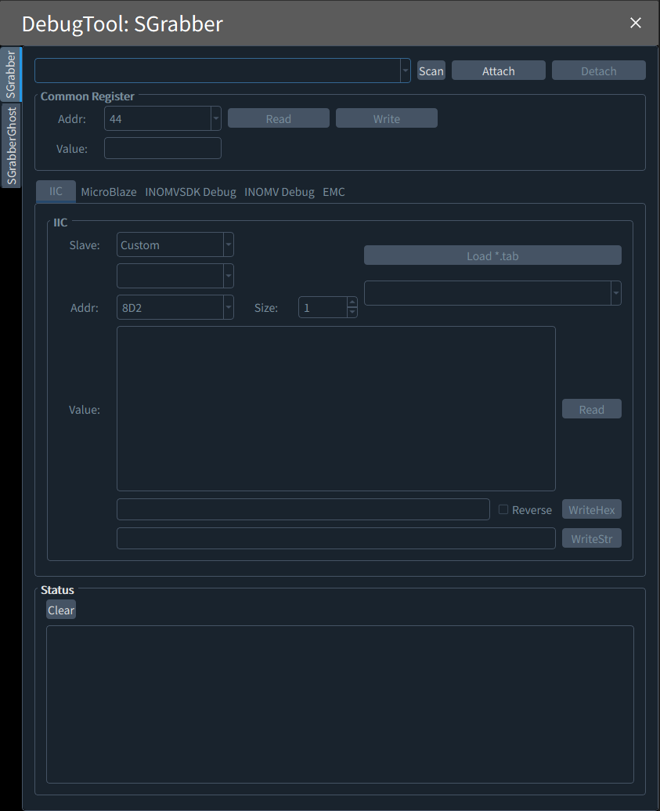
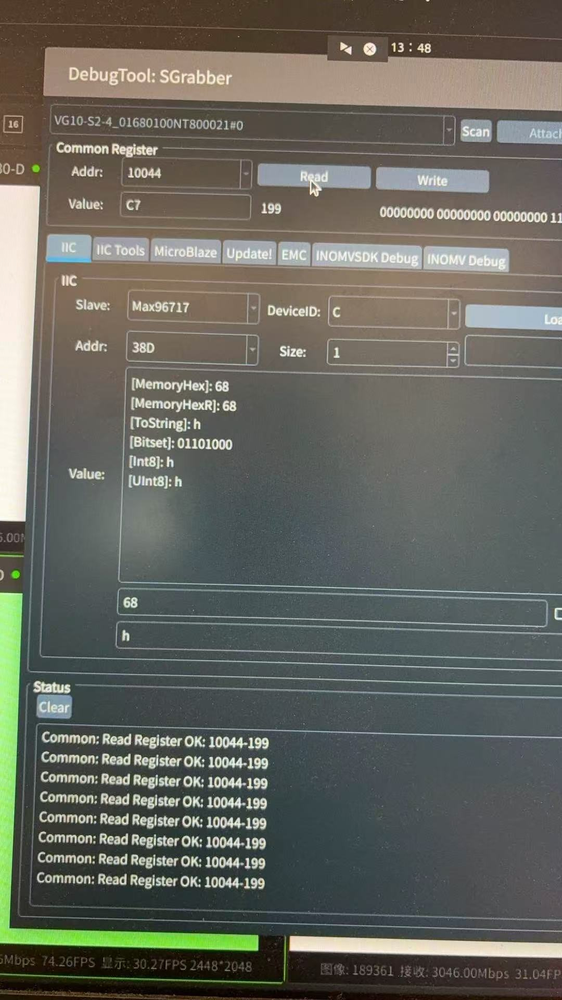

# Linux操作系统基础培训

对于指令，很多时候忘了也无所谓，直接问AI就好了，没人专门背这种东西。

## 一、Linux的起源和历史

- 1991年，芬兰大学生Linus Torvalds创建了Linux操作系统，最初目的是为了学习计算机操作系统。

- Linux是一个开源的操作系统，任何人都可以查看、修改和分发其源代码，这使得Linux得到了快速的发展和普及。

- Linux内核的发布和开源社区的形成，使得Linux逐渐成为了一个稳定、高效、安全的操作系统。

## 二、Linux的特点和优势

**（1）开源免费**

源代码公开，可自由修改、传播，无需支付版权费用。

**（2）多用户、多任务**

可同时支持多个用户登录，多个任务并行运行。

**（3）安全性高**

Linux具有强大的安全性能，包括对内核的访问控制、强制访问控制等，能够有效地保护系统和数据的安全。

**（4）可移植性强**

支持x86、ARM等多种硬件架构，广泛应用于服务器、嵌入式设备（如路由器、手机）。


## 三、常用的Linux版本


- CentOS：企业级服务器首选，稳定、安全，官方已停止维护，后续多迁移至AlmaLinux、Rocky Linux。

- Ubuntu：桌面版和服务器版兼顾，易用性强，适合新手入门。

- RedHat（RHEL）：商业版Linux，有官方技术支持，适合企业级生产环境。

- Debian：稳定性极高，开源社区活跃，是Ubuntu的基础发行版。

- SUSE：欧洲常用，服务器版性能优秀，适合金融、企业级场景。


## 四、Linux系统结构


**用户空间：**这是所有用户应用程序运行的非特权模式。应用程序无法直接访问硬件或内核内存。

**内核空间：**这是操作系统内核运行的特权模式。它拥有对硬件（CPU、内存、设备等）的完全、无限制的访问权限。

## 五、Linux文件系统目录结构


- **/根目录**

根目录，所有文件和目录的顶层目录，相当于Windows的“此电脑。

- **/home**

普通用户的家目录，每个用户有独立的子目录（如/home/inovance）。

- **/root**

超级管理员（root）的家目录，权限最高。

- **/etc**

系统配置文件目录（如网络配置、用户配置等），最常用的目录之一。

- **/bin**

存放系统基础命令（如ls、cd），所有用户均可执行。

- **/sbin**

存放系统管理命令（如reboot、shutdown），需管理员权限执行

- **/var**

存放可变文件（如日志、缓存），服务器常用（如/var/log是日志目录）

- **/tmp**

临时文件目录，重启系统后文件会丢失

- **/usr**

存放用户安装的软件、命令（如/usr/bin、/usr/lib）

- **/opt**

安装第三方或额外软件（如 Oracle、WPS）的默认位置，软件文件集中存放于此。

- **/boot**

存放系统启动所需的文件，包括内核（`vmlinuz`）、引导加载程序（如 GRUB）等

## 六、Linux权限和文件类型

1. **Linux文件/目录的权限分为3类，用“r、w、x”表示。对应的数据4,2,1。**

- r（read）：读取权限，可查看文件内容、列出目录下的文件；

- w（write）：写入权限，可修改文件内容、创建/删除目录下的文件；

- x（execute）：执行权限，可运行可执行文件、进入目录。

权限示例：“rwx r\-x r\-\-”，依次对应：所有者（rwx）、所属组（r\-x）、其他用户（r\-x）。


2. **在linux中，所有东西都被当成文件**

3. **文件权限前的第一个字母用来标识文件类型：**

- \-：一般文件

- d：目录文件

- b：块设备文件

- c：字符设备文件

- l：连接文件

- s：socket文件


## 七、Linux软件安装

ubuntu和Debian软件安装方法

```Shell
sudo apt update
sudo apt install xxx
```

## 八、Linux常用命令

### **（1）常用命令**

|命令|常用选项|功能说明|示例|
|---|---|---|---|
|ls|\-l（详细信息）<br>\-a（显示隐藏文件）<br>\-h（人性化显示大小|列出当前目录下的文件/目录|ls \-l（查看详细信息）<br>ls \-ah（查看所有文件，包括隐藏）<br>|
|cd|无常用选项|切换目录|cd /home（切换到home目录）<br>cd \.\.（返回上一级目录）<br>cd \~（回到当前用户家目录）|
|pwd|无常用选项|显示当前所在目录的绝对路径|pwd|
|cp|\-r（递归复制目录）<br>\-v（显示复制过程）|复制文件/目录|cp test\.txt /home/inovance（复制test\.txt到/home/inovance目录）<br>cp \-r test /home/inovance（复制test目录到/home/inovance）|
|mv|无常用选项|移动文件/目录，或重命名|mv test\.txt /home/inovance（移动到/home/inovance目录）<br>mv test\.txt new\.txt（重命名为new\.txt）|
|rm|\-f（强制删除，不提示）<br>\-r（递归删除目录及内容）|删除文件/目录（慎用，删除后无法恢复）|rm test\.txt（删除文件）<br>rm \-rf test（强制删除test目录及所有内容）|
|mkdir|\-p（递归创建多级目录）|创建目录（make directory）|mkdir test（创建test目录）<br>mkdir \-p a/b/c（创建a目录下的b目录下的c目录）|
|touch|无常用选项|创建空文件，或更新文件的修改时间|touch test\.txt（创建test\.txt文件）|
|cat|\-n（显示行号）|查看文件内容（适合短文<br>件）|cat test\.txt（查看test\.txt内容）<br>cat \-n test\.txt（显示行号）|

### **（2）用户与权限管理相关**

|命令|常用选项|功能说明|示例|
|---|---|---|---|
|useradd|\-m（自动创建家目录）|创建新用户（需管理员权限）|useradd \-m user2（创建user2用户，并创建/home/user2目录）|
|passwd|无常用选项<br>|设置/修改用户密码（需管<br>理员权限修改其他用户密<br>码）|passwd user2（修改user2的密码）<br>passwd（修改当前用户密码）|
|userdel|\-r（删除用户同时删除家目录）|删除用户（需管理员权限）|userdel \-r user2（删除user2用户及家目录）|
|su|\-（切换到root并加载环境变量）|切换用户|su user2（切换到user2）<br>su \-（切换到root）|
|sudo|\-i（切换到管理员用户）<br>\-s（原目录切换到管理员用户）|||
|chmod||修改文件/目录权限|chmod 755 test\.txt（所有者rwx，其他r\-x）<br>chmod \+x test\.sh（给文件添加执行权限）|
|chown|\-R（递归修改目录所有者）|修改文件/目录的所有者|chown user2 test\.txt（将test\.txt所有者改为user2）<br>chown \-R user2 test（递归修改test目录所有者）|

### （3）系统信息与进程管理相关

|命令|常用选项|功能说明|示例|
|---|---|---|---|
|uname|\-a（显示所有系统信息）|查看系统内核、架构等信息|uname \-a（Linux hc 6\.1\.75 \#1 SMP Wed Jan 14 15:14:06 CST 2026 aarch64 GNU/Linux）|
|df|\-h（显示磁盘容量）|查看磁盘分区及使用情况|df \-h（显示各分区已用/剩余容量）|
|du|\-h（人性化）<br>\-s（显示总大小）|查看文件/目录占用的磁盘空间|du \-sh test（查看test目录总大小）|
|top|无常用选项|实时查看系统进程、CPU、内存使用情况（q退出）|top（进入实时监控界面）|
|ps|\-ef（显示所有进程详细信息）|查看当前运行的进程（静态查看）||
|kill|\-9（强制终止进程）|终止指定进程（需知道进程ID，即PID）|kill \-9 1234（强制终止PID为1234的进程）|

### （4）网络相关

ifconfig：查看网络配置（IP地址、网卡信息）

ping 127\.0\.0\.1 

# linux控制系统烧录

## 研发提供文档:开发工具使用文档_v1.0.pdf

了固件烧录|镜像烧录|设备擦除|设备切换|固件解包**查看PDF**:开发工具使用文档_v1.0.pdf

如若如遇到后续版本更新,建议联系研发询问新版本INOMV对应镜像包内核支持范围,以防止所更新镜像与INOMV内核版本不兼容问题。

# linux控制器连接

## 一、如何通过网络直连视觉控制器

### 1、ADB方式直连视觉控制器

烧入完成系统后，通过type\-c接口和Windows直连。

#### （1）安装adb相关的驱动


#### （2）在adb可执行命令下打开终端


#### （3）adb登录


```Shell
.\adb.exe shell
```

#### （4）通过adb连接配置临时IP地址

```Shell
# 配置网卡0，根据自己网络连接的网卡，选择配置网口
 ifconfig end0 192.168.1.100 netmask 255.255.255.0 up
  # 配置网卡1
 ifconfig end1 192.168.1.100 netmask 255.255.255.0 up
```

备注：上面的配置是通过命令进行临时的IP配置，需要连接网线，且需要自己配置IP地址，如果设备是插在路由器或者交换机上的，设备是支持DHCP的，设备会自动获取到IP地址。直接使用ifconfig查询，分配的地址是多少即可。


#### （5）windows网络配置


## 二、HDMI连接显示器

### （1）通过HDMI显示器连接开发板，连接键盘和鼠标

视觉控制器配置方法如下


### （2）windows网络配置


### （3）MobaXterm配置连接


## 三、INOMV安装


```Shell
#添加可执行权限
sudo chmod +x INOMV.linux.aarch64.V01R01C01.run

#安装inomv软件
sudo ./INOMV.linux.aarch64.V01R01C01.run

#如果有旧版本，会自动卸载版本，之后输入Y，设备会重启

```

## 四、日志路径和配置


```Shell
# 日志路径
sudo -i
cd /opt/INOVISION/INOMV/Runtimes/INOVisionSDKData_RK3588
```


生成的日志文件


#### 生成交给研发看的错误日志方法

1.输入如下终端命令开启log日志使能

```bash
echo 1 | sudo tee /sys/module/InoSgrabberDriver/parameters/log_enable
```

2.查看日志命令

```bash
dmesg
```

可以查看到类似的日志 交给研发分析即可

```
[ 9325.046739] InoSgrabberDriver:ChannelDpcEachEngineAPI: [INFO] Receive ch_0 cam_0 dpc, dpc:224670, work:224670, notify:224670, not notify:0
[ 9325.046770] InoSgrabberDriver:ino_char_camera_poll: [DBG] return camera_0 mask 0x1 to SDK
[ 9325.046778] InoSgrabberDriver:ino_char_camera_read: [DBG] down camera_0 fullSem success
[ 9325.046782] InoSgrabberDriver:IoctlGetCurrentFrame: [INFO] Camera_0 Current Buffer index is 4
[ 9325.047949] InoSgrabberDriver:IoctlReleaseCurrentFrame: [INFO] Release camera_0 frame_4 to empty list
[ 9325.047954] InoSgrabberDriver:ino_char_camera_poll: [DBG] return camera_0 mask 0x0 to SDK
[ 9325.053750] InoSgrabberDriver:xdma_user_irq_isr: [DBG] user_idx=2
[ 9325.053760] InoSgrabberDriver:EngineStartAPI: [DBG] engine_0 start
[ 9325.053762] InoSgrabberDriver:HandleUserEventAPI: [INFO] Ch_0 Cam_1 is ready, count:537171
[ 9325.055352] InoSgrabberDriver:xdma_channel_irq_isr: [INFO] channel_0 isr occurred (irq=139)
[ 9325.055356] InoSgrabberDriver:EngineDisableInterruptAPI: [DBG] disable channel_0 interrupt
[ 9325.055367] InoSgrabberDriver:EngineStopAPI: [DBG] engine_0 stopped
[ 9325.055369] InoSgrabberDriver:EngineEnableInterruptAPI: [DBG] enable channel_0 interrupt
[ 9325.055371] InoSgrabberDriver:ChannelDpcEachEngineAPI: [INFO] Receive ch_0 cam_1 dpc, dpc:537171, work:537171, notify:537171, not notify:0
```

## 五、启动软件

```Shell
#启动软件
sudo INOMV
```

# linux控制器常见问题处理流程

当出现软件安装过程中报出的错误后,优先选择将该错误截图交给AI过滤一遍,以下为常见问题处理结果。

## 软件相关常见问题

软件相关问题都可以通过AI过滤一遍的方法定位一个大致问题，deepseek、免费的chatgpt或者谷歌的gemini就可以。




### xcb库缺失



AI提示如下：



XCB为QT软件核心库,而我们的INOMV又由QT制作，说明**要么环境中没有QT，要么环境中找不到QT**

而找不到qt**最常见的原因就是把qt环境安装到了机械硬盘**下。linux操作环境中硬盘是需要挂载操作的，所以没有挂在就相当于系统内没有这个硬盘，让客户挂在一下或者把qt安装到固态硬盘里就好，我们的固态硬盘是默认的系统盘。

### 软件签证证书工具没下载

​	我们在安装安卓系统/IOS系统手机里下载软件的时候要一个签证工具，是操作系统为了保证下载的软件是合法合规的才做的这个东西。正常来讲官方的ubuntu/Debian系统一定会带这个东西，但很多客户里的系统操作内核都是自己购买的独立系统，会缺少sign-file签证工具，所以会跳出如下问题:

```bash
ls /lib/modules/$(uname -r)/build/scripts/sign-file
ls: cannot access '/lib/modules/6.1.77-rt24-wanghuo/build/scripts/sign-file': No such file or directory
root@wanghuo:~#
```

至于解决方法很简单，缺签证工具让客户问问AI，sign-file下载的方式即可






## 硬件相关常见问题

### 最常见的问题：不出图

对于不出图问题，有一个固定的流程。先说目的:通过iic通讯查看哪一个寄存器出了问题，并将现象与研发沟通。

首先打开INOMV，做出如下操作:

1. 点击通用
2. 切换到关于



请按照如下键盘操作:输入 

1. 上
2. 下
3. 左
4. 右
5. A
6. B
7. 回车Enter

(顺序一个都不能错，错了切页面刷一下就好)

输入后页面会出现DEBUG MODE ON(测试模式开启)



关掉页面，点击帮助会发现额外出现隐藏选项，点击SGrabber







不出图定位流程：@所有人
1.A，B路不出图读mipi寄存器10040；C，D路不出图读寄存器10044，连续读看寄存器值是否变化。不变化跳到2
2.读96724(SLAVE地址4E)寄存器A，B路：8D2；C,D路8D3 是否变化，不变化跳到3
3.读96711寄存器(slave地址A：82 ，B：84，C：86，D：88)38d 38e是否变化，不变化则没数据

将出现的情况交由研发分析

### 信号触发问题

如果遇到信号触发不稳定的问题，在分析不出图之前，我们要想办法让客户找到示波器看到触发信号是否是抖动的，信号的上升是有抖动时间的，如果在抖动时间内输出信号，当然会跳变，如下图所示：


所以一定要先确定输入信号源是否是抖动时间内的，经常有客户在信号自己的10MS抖动时间内就输出信号了，是信号逻辑有误，与触发无关。
